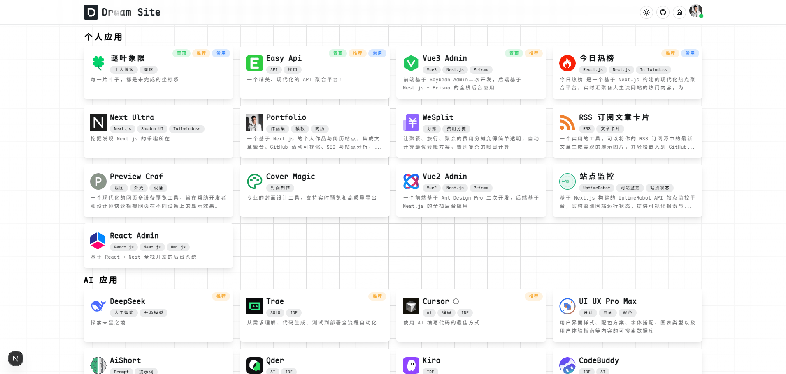
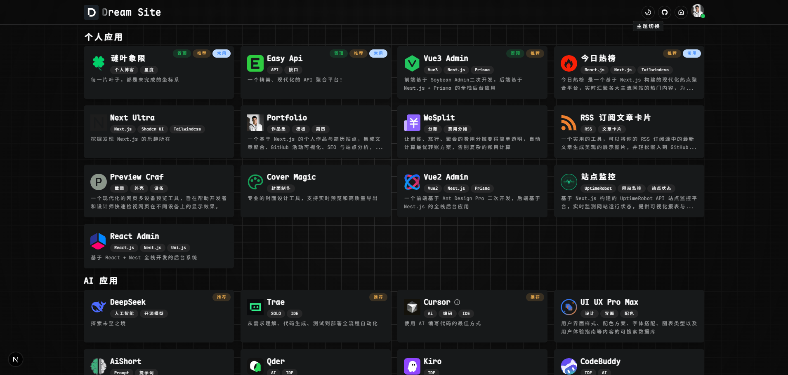
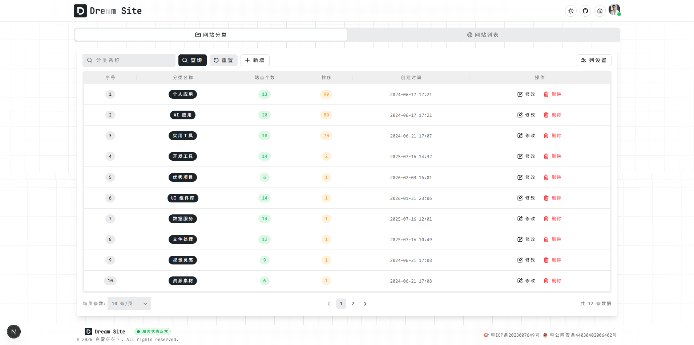
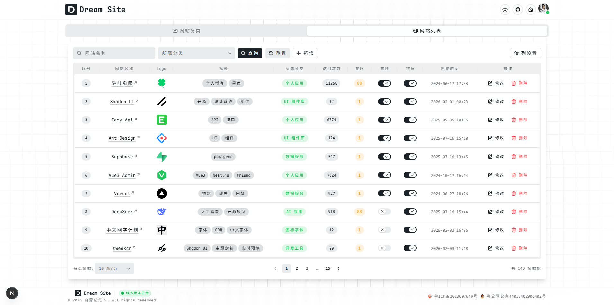
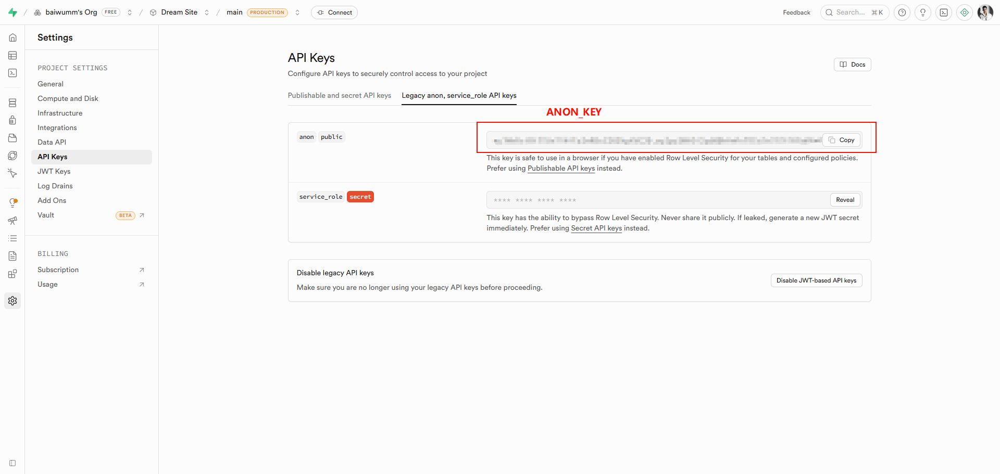
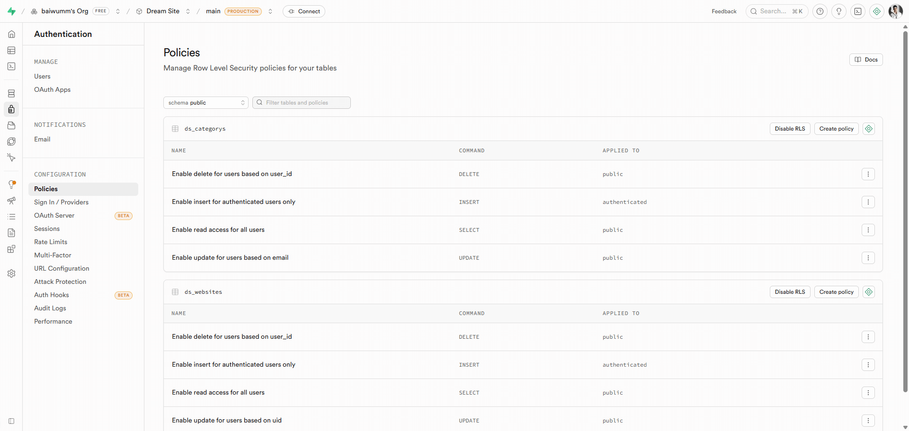
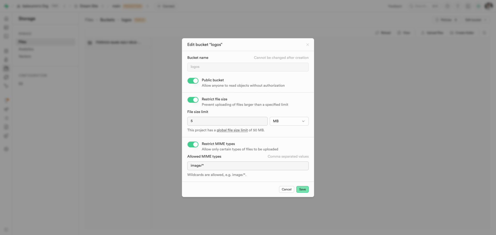

<div align="center">

<h2>Dream Site</h2>
<p>一个以极简设计呈现的现代化个人导航站，帮助你高效访问常用网站与优质资源。</p>
</div>

<div align="center">
  <a href="https://vercel.com" target="_blank">
    
  </a>
  <a href="https://nextjs.org/" target="_blank">
    
  </a>
  <a href="https://supabase.com/" target="_blank">
    
  </a>
  <a href="https://tailwindcss.com/" target="_blank">
    
  </a>
  <a href="./LICENSE" target="_blank">
    
  </a>
</div>

## ☘️ 项目简介

`Dream Site` 是一个现代化的个人站点导航系统，旨在为用户提供美观、高效的个人网站收藏与管理体验。无论你是开发者、设计师还是内容创作者，都可以用它来组织和展示你喜爱的网站资源。

## 🌿 在线体验

➡️ [点击打开](https://dream.baiwumm.com/)

## 🪴 技术栈

- **前端框架**: [Next 16.0](https://nextjs.org/) (基于 React19.x)
- **UI组件**: [Hero UI](https://www.heroui.com/)
- **样式方案**: [Tailwind CSS](https://www.tailwindcss.cn/)
- **后端服务**: [Supabase](https://supabase.com/) (开源Firebase替代品)
- **部署平台**: 支持 `Vercel` 等多种部署方式

## ✨ 特性
- 🚀 **高性能**: 基于最新前端技术栈，极速响应
- 🌓 **主题切换**: 完善的亮色/暗黑模式支持
- 🔍 **SEO友好**: 支持SSR渲染，优化搜索引擎收录
- 📱 **响应式设计**: 适配各种设备屏幕
- 🔒 **安全认证**: 基于Supabase的完整用户系统
- 🧩 **模块化架构**: 清晰的目录结构，便于二次开发

## 🪴 项目截图

| 亮色模式 | 暗色模式 |
|----------|----------|
|  |  |

| 网站分类 | 网站列表 |
|----------|----------|
|  |  |

## 🚀 快速开始

### 🌳 环境要求
- Node.js ≥ 18.17 (推荐最新LTS版本)
- pnpm (推荐) 或 npm/yarn

### ⚙️ 环境变量

在项目根目录创建 `.env`，示例：

```bash
NEXT_PUBLIC_SUPABASE_URL="xxx"
NEXT_PUBLIC_SUPABASE_ANON_KEY="xxx"
NEXT_PUBLIC_SUPABASE_STORAGE_URL="xxx"

# 项目名称
NEXT_PUBLIC_APP_NAME = 'Dream Site'
# 项目描述
NEXT_PUBLIC_APP_DESC = '一个以极简设计呈现的现代化个人导航站，帮助你高效访问常用网站与优质资源。'
# 项目关键词
NEXT_PUBLIC_APP_KEYWORDS = 'Dream Site,极简导航,网站导航,个人站点,书签管理,资源导航,Next.js'
# 项目域名
NEXT_PUBLIC_APP_URL = 'https://dream.baiwumm.com'
# 版权
NEXT_PUBLIC_COPYRIGHT = '白雾茫茫丶'
# 网站ICP
NEXT_PUBLIC_ICP = '粤ICP备2023007649号'
# 网站公网备案
NEXT_PUBLIC_GUAN_ICP = '粤公网安备44030402006402号'
```

### 🧑‍💻 本地开发
```bash
# 克隆项目
git clone https://github.com/baiwumm/dream-site.git

# 进入项目目录
cd dream-site

# 安装依赖
pnpm install

# 启动开发服务器
pnpm dev
```

### 📝 Supabase 配置
1. 进入 [supabase 控制台](https://supabase.com/dashboard)，创建项目，并获取`NEXT_PUBLIC_SUPABASE_URL`和`NEXT_PUBLIC_SUPABASE_ANON_KEY`

2. 执行以下 `Sql`，生成项目需要的数据库表
```sql
-- 网站分类
create table public.ds_categorys (
  id uuid not null default gen_random_uuid (),
  name text not null,
  created_at timestamp with time zone not null default now(),
  updated_at timestamp with time zone not null default now(),
  user_id uuid null default auth.uid (),
  email text null,
  sort smallint null,
  constraint site_category_pkey primary key (id),
  constraint site_category_name_key unique (name)
) TABLESPACE pg_default;

create trigger trg_ds_categorys_insert BEFORE INSERT on ds_categorys for EACH row
execute FUNCTION handle_ds_categorys_insert ();

create trigger trg_ds_categorys_update BEFORE
update on ds_categorys for EACH row
execute FUNCTION handle_ds_categorys_update ();

-- 网站列表
create table public.ds_websites (
  id uuid not null default gen_random_uuid (),
  created_at timestamp with time zone not null default now(),
  user_id uuid null default auth.uid (),
  email text null default 'NULL'::text,
  name text null,
  "desc" text null,
  logo text null,
  tags text[] null,
  sort smallint null,
  updated_at timestamp with time zone null default now(),
  url text null,
  pinned boolean null default false,
  vpn boolean null default false,
  category_id uuid null default gen_random_uuid (),
  recommend boolean null default false,
  "visitCount" integer null default 0,
  "commonlyUsed" boolean null default false,
  "logoAccent" text null,
  constraint websites_pkey primary key (id),
  constraint ds_websites_name_key unique (name),
  constraint ds_websites_category_id_fkey foreign KEY (category_id) references ds_categorys (id)
) TABLESPACE pg_default;

create index IF not exists idx_ds_websites_id on public.ds_websites using btree (id) TABLESPACE pg_default;

create trigger trg_ds_websites_insert BEFORE INSERT on ds_websites for EACH row
execute FUNCTION handle_ds_websites_insert ();

create trigger trg_ds_websites_update BEFORE
update on ds_websites for EACH row
execute FUNCTION handle_ds_websites_update ();
```
3. 执行以下 `Sql`，生成 `visitCount` 访问统计函数：
```sql
SELECT pg_get_functiondef(oid) as function_definition
FROM pg_proc 
WHERE proname = 'increment_visit_count';

drop function if exists increment_visit_count(uuid);

create or replace function increment_visit_count(row_id uuid)
returns bigint
language plpgsql
security definer
as $$
declare
  new_count bigint;
begin
  update public.ds_websites
  set "visitCount" = coalesce("visitCount", 0) + floor(random() * 10 + 1)
  where id = row_id
  returning "visitCount" into new_count;

  if new_count is null then
    raise exception 'update blocked or row not found, id=%', row_id;
  end if;

  return new_count;
end;
$$;

grant execute on function increment_visit_count(uuid)
to anon, authenticated;
```
4. 执行以下 `Sql`，用于 `Insert` 和 `Update` 触发器，自动更新列：
```sql
-- ds_categorys
-- =====================================================
-- 1. INSERT：自动写入 user_id / email / created_at / updated_at
-- =====================================================
create or replace function public.handle_ds_categorys_insert()
returns trigger
language plpgsql
security definer
as $$
begin
  -- 当前登录用户 ID
  new.user_id := auth.uid();

  -- 从 JWT 中读取 email
  new.email := auth.jwt() ->> 'email';

  -- 时间兜底
  new.created_at := now();
  new.updated_at := now();

  return new;
end;
$$;


drop trigger if exists trg_ds_categorys_insert on public.ds_categorys;

create trigger trg_ds_categorys_insert
before insert on public.ds_categorys
for each row
execute function public.handle_ds_categorys_insert();


-- =====================================================
-- 2. UPDATE：自动更新 updated_at / user_id / email
-- =====================================================
create or replace function public.handle_ds_categorys_update()
returns trigger
language plpgsql
security definer
as $$
begin
  -- 更新时间
  new.updated_at := now();

  return new;
end;
$$;


drop trigger if exists trg_ds_categorys_update on public.ds_categorys;

create trigger trg_ds_categorys_update
before update on public.ds_categorys
for each row
execute function public.handle_ds_categorys_update();


-- ds_websites
-- =====================================================
-- 1. INSERT：自动写入 user_id / email / created_at / updated_at
-- =====================================================
create or replace function public.handle_ds_websites_insert()
returns trigger
language plpgsql
security definer
as $$
begin
  -- 当前登录用户 ID
  new.user_id := auth.uid();

  -- 从 JWT 中读取 email
  new.email := auth.jwt() ->> 'email';

  -- 时间兜底
  new.created_at := now();
  new.updated_at := now();

  return new;
end;
$$;


drop trigger if exists trg_ds_websites_insert on public.ds_websites;

create trigger trg_ds_websites_insert
before insert on public.ds_websites
for each row
execute function public.handle_ds_websites_insert();


-- =====================================================
-- 2. UPDATE：自动更新 updated_at / user_id / email
-- =====================================================
create or replace function public.handle_ds_websites_update()
returns trigger
language plpgsql
security definer
as $$
begin
  -- 更新时间
  new.updated_at := now();

  return new;
end;
$$;


drop trigger if exists trg_ds_websites_update on public.ds_websites;

create trigger trg_ds_websites_update
before update on public.ds_websites
for each row
execute function public.handle_ds_websites_update();

```
5. 进入 [Authentication](https://supabase.com/dashboard/project/athbiwlqrieaoetfapxd/auth/users) ，自行配置  [Policies](https://supabase.com/dashboard/project/athbiwlqrieaoetfapxd/auth/policies)  和 [Sign In / Providers](https://supabase.com/dashboard/project/athbiwlqrieaoetfapxd/auth/providers)

6. 进入 [Storage](https://supabase.com/dashboard/project/athbiwlqrieaoetfapxd/storage/files)，创建保存网站图标的存储桶


## ⚙️ Vercel 一键部署
1. `Fork` 本项目，在 `Vercel` 官网点击 `New Project`
2. 点击 `Import Git Repository` 并选择你 fork 的此项目并点击 `import`
3. `PROJECT NAME`自己填，`FRAMEWORK PRESET` 选 `Other` 然后直接点 `Deploy` 接着等部署完成即可

<a href="https://vercel.com/dashboard" target="_blank">

</a>

## 📜 许可证
本项目采用 [MIT](LICENSE) 许可证。

## ⭐ Star History

[](https://star-history.com/#baiwumm/dream-site&Date)