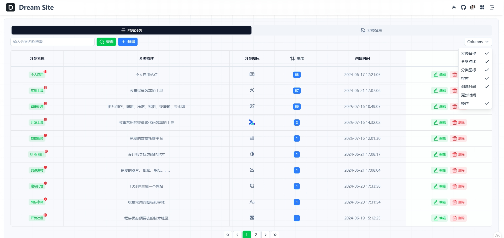
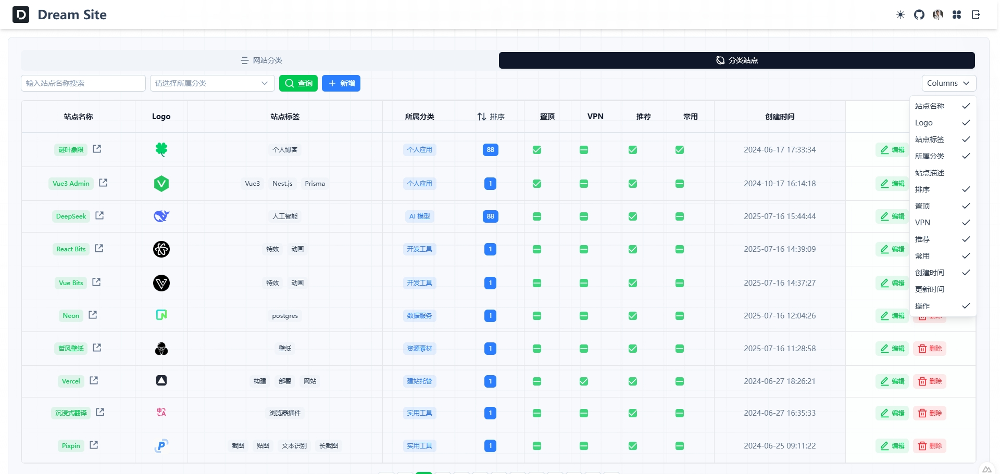

<div align="center">

<h2>Dream Site</h2>
<p>一个精美、现代化的个人站点导航</p>
</div>

<div align="center">
  <a href="https://vercel.com" target="_blank">
    
  </a>
  <a href="https://nuxt.com/" target="_blank">
    
  </a>
  <a href="https://supabase.com/" target="_blank">
    
  </a>
  <a href="https://tailwindcss.com/" target="_blank">
    
  </a>
</div>

## ☘️ 项目简介

`Dream Site` 是一个现代化的个人站点导航系统，旨在为用户提供美观、高效的个人网站收藏与管理体验。无论你是开发者、设计师还是内容创作者，都可以用它来组织和展示你喜爱的网站资源。

## 🌿 在线体验

➡️ [点击打开](https://site.baiwumm.com/)

## 🪴 技术栈

- **前端框架**: [Nuxt 4.0](https://nuxt.com/) (基于Vue 3)
- **UI组件**: [NuxtUI](https://ui.nuxt.com/)
- **样式方案**: [Tailwind CSS](https://www.tailwindcss.cn/)
- **后端服务**: [Supabase](https://supabase.com/) (开源Firebase替代品)
- **部署平台**: 支持 `Vercel` 等多种部署方式

## ✨ 特性
- 🚀 **高性能**: 基于最新前端技术栈，极速响应
- 🌓 **主题切换**: 完善的亮色/暗黑模式支持
- 🔍 **SEO友好**: 支持SSR渲染，优化搜索引擎收录
- 📱 **响应式设计**: 适配各种设备屏幕
- 🔒 **安全认证**: 基于Supabase的完整用户系统
- 🧩 **模块化架构**: 清晰的目录结构，便于二次开发

## 🪴 项目截图

| 亮色模式 | 暗色模式 |
|----------|----------|
|  |  |

| 分类管理 | 站点列表 |
|----------|----------|
|  |  |

## 🚀 快速开始

### 🌳 环境要求
- Node.js ≥ 18.17 (推荐最新LTS版本)
- pnpm (推荐) 或 npm/yarn

### 🧑‍💻 本地开发
```bash
# 克隆项目
git clone https://github.com/baiwumm/dream-site.git

# 进入项目目录
cd dream-site

# 安装依赖
pnpm install

# 启动开发服务器
pnpm dev
```

### 📝 初始化数据库
1. 进入 [supabase 控制台](https://supabase.com/dashboard)，创建项目，并获取`SUPABASE_URL`和`SUPABASE_KEY`
2. 导入数据库结构，将 `initSupabase.sql` 导入到 `Supabase SQL` 编辑器中执行。
3. 在根目录下创建`.env`文件，并添加以下内容：
```env
SUPABASE_URL="xxx"
SUPABASE_KEY="xxx"
```
4. 进入 `Authentication` ，自行配置 `Policies` 和 `Sign In / Providers`

## ⚙️ Vercel 一键部署
1. `Fork` 本项目，在 `Vercel` 官网点击 `New Project`
2. 点击 `Import Git Repository` 并选择你 fork 的此项目并点击 `import`
3. `PROJECT NAME`自己填，`FRAMEWORK PRESET` 选 `Other` 然后直接点 `Deploy` 接着等部署完成即可

<a href="https://vercel.com/dashboard" target="_blank">

</a>

## ⭐ Star History

[](https://star-history.com/#baiwumm/dream-site&Date)