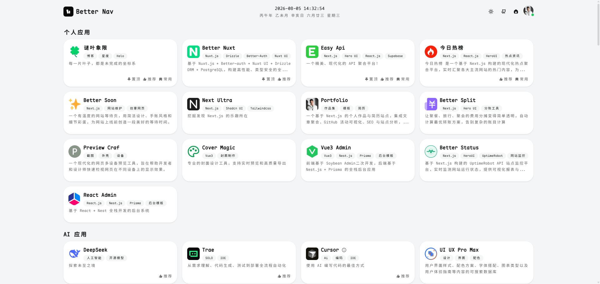
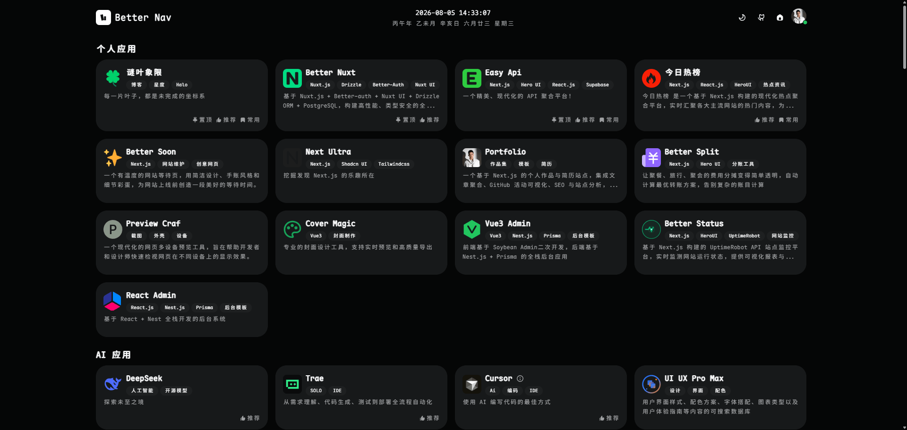
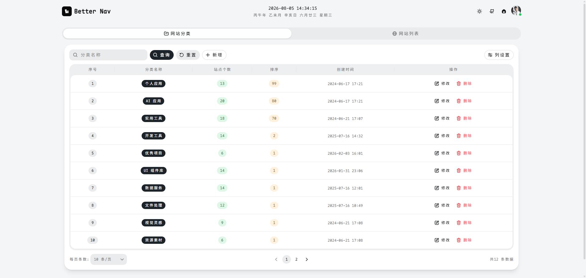
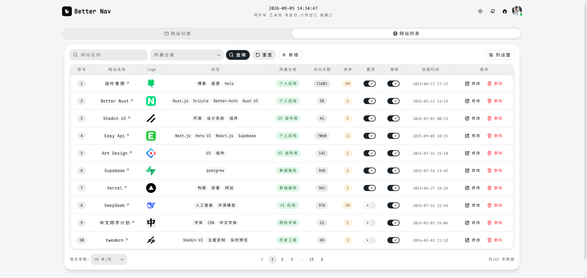

<div align="center">
  
  <h1>Better Nav</h1>
  <p>一个把常用网址收拾得干干净净的小站。</p>
</div>

<div align="center">
  <a href="https://dream.baiwumm.com/" target="_blank">
    
  </a>
  <a href="https://nextjs.org/" target="_blank">
    
  </a>
  <a href="https://www.heroui.com/" target="_blank">
    
  </a>
  <a href="https://supabase.com/" target="_blank">
    
  </a>
  <a href="./LICENSE" target="_blank">
    
  </a>
</div>

## 🌱 简介

`Better Nav` 是一个基于 Next.js 与 Supabase 的个人导航站。

它专注做一件小事：把常用网址放在一起，打开就能用。支持亮暗主题、响应式布局、基础 SEO，以及登录后的网站分类与管理。

## 🌿 截图

| 亮色模式 | 暗色模式 |
| --- | --- |
|  |  |

| 分类管理 | 站点列表 |
| --- | --- |
|  |  |

## ☘️ 技术栈

- Next.js 16 + React 19
- HeroUI v3
- Tailwind CSS v4
- Supabase
- Vercel

## 🪴 本地开发

### 🌱 环境要求

- Node.js >= 18.17
- pnpm

### 🌵 启动项目

```bash
git clone https://github.com/baiwumm/better-nav.git
cd better-nav
pnpm install
pnpm dev
```

先将 `.env.example` 复制为 `.env.local`，再补全你自己的环境变量。

默认访问：`http://localhost:3000`

## 🌼 环境变量

项目主要使用这些环境变量：

```bash
NEXT_PUBLIC_SUPABASE_URL=
NEXT_PUBLIC_SUPABASE_ANON_KEY=
NEXT_PUBLIC_SUPABASE_STORAGE_BUCKET=logos

NEXT_PUBLIC_APP_NAME=Better Nav
NEXT_PUBLIC_APP_TITLE=一个把常用网址收拾得干干净净的小站
NEXT_PUBLIC_APP_DESC=把常用网址放在一起，打开就能用。
NEXT_PUBLIC_APP_URL=http://localhost:3000

NEXT_PUBLIC_AUTHOR_NAME=
NEXT_PUBLIC_AUTHOR_ROLE=
```

完整示例见 [`.env.example`](./.env.example)。

## 🍀 Supabase 配置

开始之前，你需要在 Supabase 中准备好以下内容：

1. 创建项目，并填写 `NEXT_PUBLIC_SUPABASE_URL` 与 `NEXT_PUBLIC_SUPABASE_ANON_KEY`
2. 创建存储桶：`logos`
3. 配置认证方式与访问策略
4. 初始化项目依赖的数据结构：`ds_categorys`、`ds_websites`、`increment_visit_count`，以及对应的插入 / 更新触发器

如果你准备把它作为自己的导航站二次使用，最省事的方式是按当前前端字段结构直接在 Supabase 中建表，再根据自己的登录方式补齐鉴权策略。

## 🌲 部署

推荐直接部署到 Vercel：

1. Fork 本项目
2. 在 Vercel 中导入仓库
3. 配置环境变量
4. 点击 Deploy

## 🌸 许可证

[MIT](./LICENSE) © [baiwumm](https://baiwumm.com)
