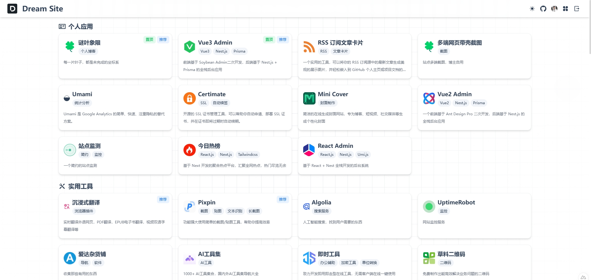
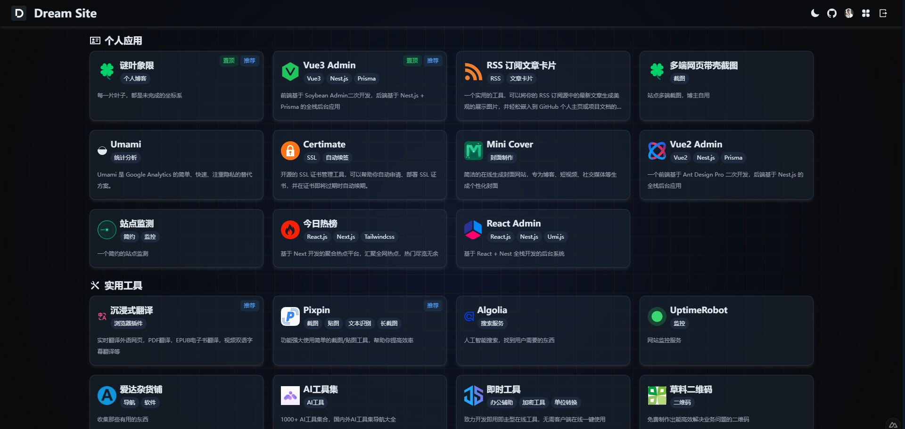

<div align="center">

<h2>Dream Site</h2>
<p>一个精美的个人站点导航</p>
</div>

## 🪴 项目信息
* 😝 在线体验：https://site.baiwumm.com/
* 🎯 技术栈：[Nuxt4.0](https://nuxt.com/)、[Vue.js](https://cn.vuejs.org/)、[Tailwindcss](https://www.tailwindcss.cn/)、[Supabase](https://supabase.com/)、[NuxtUI](https://ui.nuxt.com/)

## ✨ 特性
* 使用前端最新技术栈开发
* 极快响应、便于开发部署
* 目录结构清晰，轻量级，前后端一体
* 支持多种部署方式，优先推荐 [Vercel](https://vercel.com/)
* 支持暗黑模式
* 支持 `SSR` 渲染，利于 `SEO` 优化 

## 💻 演示图

<div style="display:flex;justify-content:space-between;">


</div>

<div style="display:flex;justify-content:space-between;">


</div>

## 🧑‍💻 项目运行
**环境：Node.js > 18.17**

```powershell
// 克隆项目
git clone https://github.com/baiwumm/dream-site.git

// 安装依赖
pnpm install

// 运行
pnpm dev
```

## ⚙️ Vercel 一键部署
1. `Fork` 本项目，在 `Vercel` 官网点击 `New Project`
2. 点击 `Import Git Repository` 并选择你 fork 的此项目并点击 `import`
3. `PROJECT NAME`自己填，`FRAMEWORK PRESET` 选 `Other` 然后直接点 `Deploy` 接着等部署完成即可

<a href="https://vercel.com/dashboard" target="_blank">

</a>

## ⚙️ Vecel 本地部署
```powershell
// 全局安装 vercel
npm i -g vercel

// 登录
vercel login

// 项目推送
vercel

// 挂载生产
vercel --prod
```

## ✅ TODO
◻️ 首页添加每日一图 `Banner`
◻️ 添加全局资源搜索框
◻️ 支持更多登录方式
◻️ 优化 `UI` 展示
...

## ⭐ Star History

[](https://star-history.com/#baiwumm/dream-site&Date)